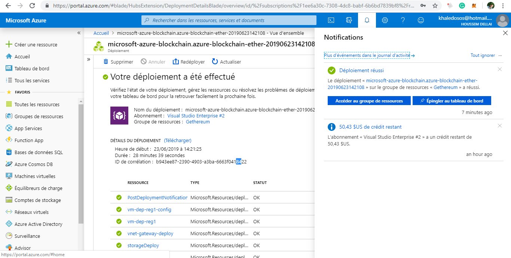
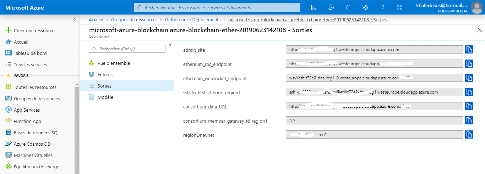
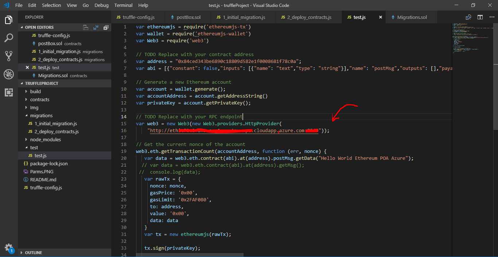
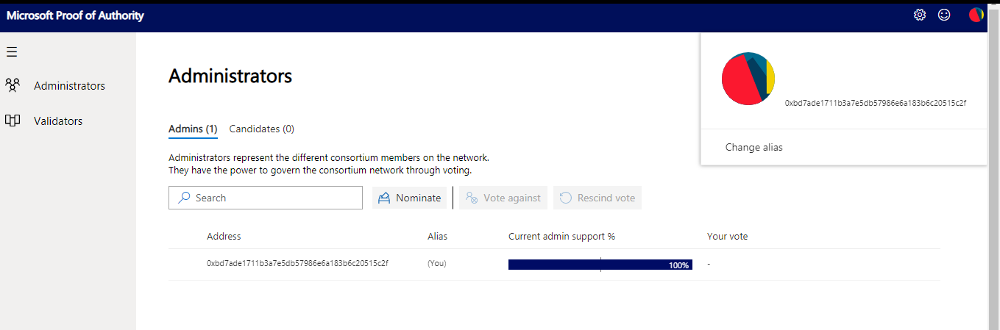
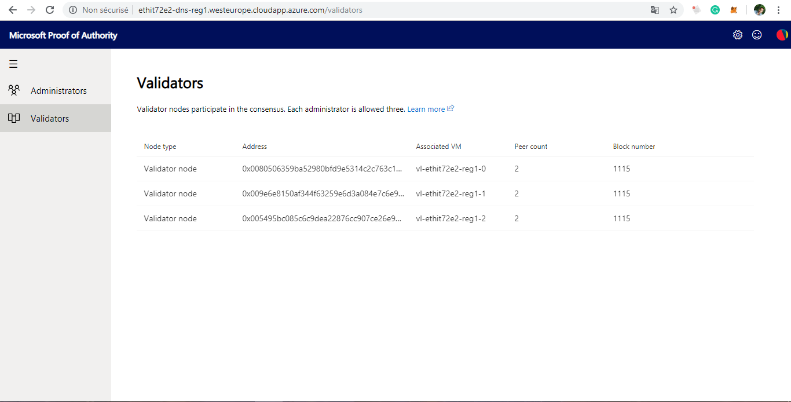

# AzureBlockchainPoA
 Deploying Blockchain Applications using Azure Blockchain Ethereum POA

I started using Microsoft Azure Blockchain to implement a sample POC application leveraging Blockchain technology.
This will illustrates the workflow and the various possibilities that have been encountered during the demo.

# Setup Ethereum Proof-of Authority (POA) network on Azure
Proof-of-authority is a consensus protocol which is more suitable for permissioned networks where all consensus participants are known and reputable.
Without the need for CPU,mining, Proof Of authority is more efficient while still retaining Byzantine fault tolerance.

You can refer to the official microsoft documentation for deploying Ethereum POA consortium on Azure.
Once the deployment has completed, you’ll be able to access the following parameters through the Azure portal.

* Ethereum RPC endpoint
* Governance Dashboard URL
* Azure Monitor URL
* Data URL

Please make a note of the Ethereum RPC endpoint as we will be using it for our configuration.
A remote procedure call (RPC) is a interprocess communication technique that is used for point-to-point communications between software applications. 
Client and server applications communicate during this process.In this usecase you should to replace in test.js file with your RPC endpoint.

# Concepts
* Admin - An Ethereum account that is used to manage participation for a given consortium member.Admin account,during the deployment of the proof-of-authority nodes, you'll be asked for an Admin Ethereum address , we can use Metamask

* Validator - A machine associated with an Ethereum account that participates in consensus validator node In the proof-of-authority protocol, validator nodes take the place of traditional miner nodes. Each validator has a unique Ethereum identity that gets added to a smart-contract permission list. Once a validator is on this list, it can participate in the block creation process.
Also this solution also comes with Azure Monitor to track node and network statistics. For application developers, this provides visibility into the underlying blockchain to track block generation statistics. 

